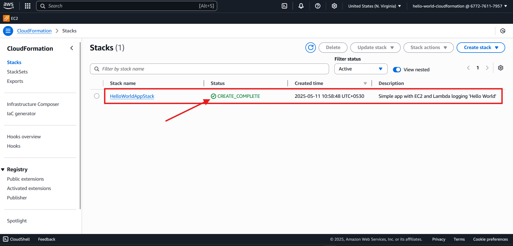
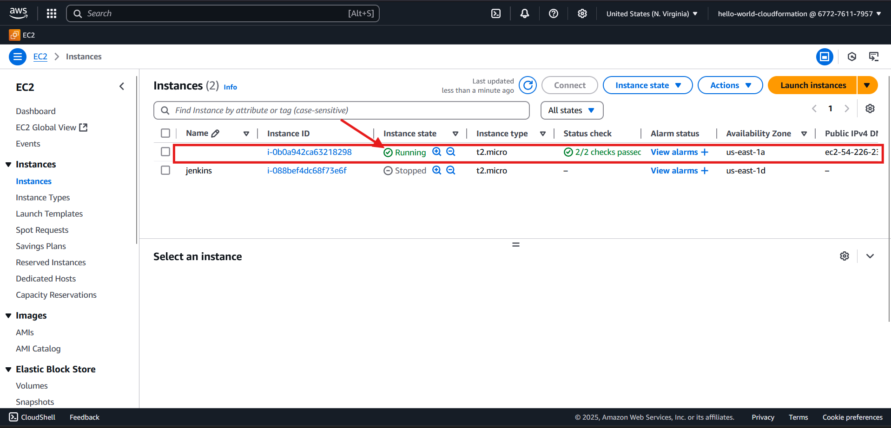
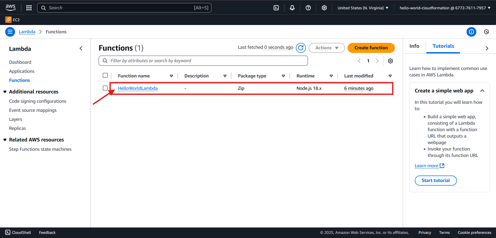

# Hello World AWS CloudFormation Project

This project demonstrates how to use AWS CloudFormation to provision and manage AWS resources including EC2 instances and Lambda functions. The template creates a simple "Hello World" application with an EC2 instance and a Lambda function that logs "Hello World".



## Project Overview

This CloudFormation template creates:
- An EC2 instance with SSH access
- A Lambda function that logs "Hello World"
- All necessary IAM roles and security groups

## Template Structure

The `template.yaml` file defines:

- **Parameters**: EC2 key pair name for SSH access
- **Resources**:
  - EC2 instance with security group allowing SSH access
  - Lambda function with execution role
  - IAM role with permissions for Lambda execution
- **Outputs**: Instance ID and Lambda function name

## Prerequisites

- AWS CLI installed
- AWS account with appropriate permissions
- EC2 key pair

## Setup Instructions

### 1. Install AWS CLI

Download and install the AWS CLI MSI installer for Windows (64-bit):
```
https://awscli.amazonaws.com/AWSCLIV2.msi
```

Verify installation by opening a command prompt and running:
```
aws --version
```

### 2. Configure AWS IAM User

1. Navigate to AWS Console and search for IAM
2. Click on "Users" and "Create user"
3. Configure the user:
   - Name: hello-world-cloudformation
   - Enable console access
   - Set custom password: qwerty1234# (Note: Use stronger passwords in production)
   - Uncheck "Users must create a new password at next sign-in"
4. Assign the following permissions:
   - AmazonEC2FullAccess
   - AWSLambda_FullAccess
   - IAMFullAccess
   - AWSCloudFormationFullAccess
   - CloudWatchLogsFullAccess
5. Add tag: Key: `serverless-geo-logger admin`, Value: `required`
6. Create the user

### 3. Sign in as the New User

Use the generated sign-in URL:
```
https://67727XXXXX.signin.aws.amazon.com/console
```
- Username: hello-world-cloudformation
- Password: qwert****

### 4. Create Access Key for CLI

1. In IAM, select the user and create an access key
2. Use case: Command Line Interface (CLI)
3. Add description tag: "For hello world application using cloudformation"
4. Save the credentials

### 5. Configure AWS CLI

Run the following command and enter your access key details:

```powershell
aws configure
```
Input:
- AWS Access Key ID: AKIA********TFUPBAW
- AWS Secret Access Key: pOn9**********************mgbmQ
- Default region name: us-east-1
- Default output format: (leave empty)

### 6. Create EC2 Key Pair

1. Go to EC2 console
2. Navigate to "Key Pairs" under "Network & Security"
3. Create a key pair named "hello-world-cloudformation"
4. Select Key type: RSA
5. Private key file format: .pem
6. Save the downloaded .pem file

### 7. Verify AWS CLI Setup

Run this command to verify AWS CLI is properly configured:

```powershell
aws ec2 describe-instances
```

Expected output:
```json
{
    "Reservations": []
}
```

## Deployment

### Create the CloudFormation Stack

Run this command to deploy the CloudFormation template:

```powershell
aws cloudformation create-stack `
  --stack-name HelloWorldAppStack `
  --template-body file://template.yaml `
  --parameters ParameterKey=EC2KeyPair,ParameterValue=hello-world-cloudformation `
  --capabilities CAPABILITY_NAMED_IAM
```

Expected output:
```json
{
    "StackId": "arn:aws:cloudformation:us-east-1:67727XXXXX:stack/HelloWorldAppStack/0833fe00-XXXX-XXXX-XXXX-XXXXXXXXXXXX"
}
```

### Verify Deployment

1. Check the stack status in the AWS CloudFormation console:

   

2. Verify EC2 instance creation in the EC2 console:

   

3. Verify Lambda function creation in the Lambda console:

   

### Check Stack Outputs

```powershell
aws cloudformation describe-stacks --stack-name HelloWorldAppStack `
  --query 'Stacks[0].Outputs'
```

Output:
```json
[
    {
        "OutputKey": "InstanceID",
        "OutputValue": "i-0b0a942*****8298",
        "Description": "EC2 Instance ID"
    },
    {
        "OutputKey": "LambdaName",
        "OutputValue": "HelloWorldLambda",
        "Description": "Lambda function name"
    }
]
```

## Testing the Lambda Function

Invoke the Lambda function:

```powershell
aws lambda invoke `
  --function-name HelloWorldLambda `
  --payload '{}' `
  response.json
```

Output:
```json
{
    "StatusCode": 200,
    "ExecutedVersion": "$LATEST"
}
```

This command creates a `response.json` file containing the Lambda function's response:

```json
{"statusCode":200,"body":"Hello World"}
```

This shows our Lambda function successfully returned a 200 status code and the "Hello World" message.

### Check CloudWatch Logs

List the log groups:

```powershell
aws logs describe-log-groups
```

Get the most recent log stream:

```powershell
$logGroup = "/aws/lambda/HelloWorldLambda"
$streamName = aws logs describe-log-streams --log-group-name $logGroup `
  --order-by LastEventTime --descending --query "logStreams[0].logStreamName" `
  --output text
```

View the log events:

```powershell
aws logs get-log-events `
  --log-group-name $logGroup `
  --log-stream-name $streamName `
  --region us-east-1
```

In the logs, you can see the "Hello World from Lambda!" message:

```
2025-05-11T05:43:51.072Z 8357f2d2-XXXX-XXXX-XXXX-XXXXXXXXXXXX INFO Hello World from Lambda!
```

## Challenges Faced

During deployment, the stack initially failed with a "Rolling back" status. The issue was an incorrect AMI ID that didn't match the selected region (us-east-1). After finding and updating the correct AMI ID in the template, the deployment succeeded.

Another challenge was related to sharing this project on GitHub. The initial documentation contained access keys and other sensitive information. GitHub blocked the push due to security concerns about exposing credentials. To resolve this, all sensitive information (access keys, account IDs, passwords) had to be masked before the repository could be successfully pushed.

## CloudFormation Template Details

The template (`template.yaml`) provisions:

1. **Security Group**: Allowing SSH access (port 22)
2. **EC2 Instance**: 
   - t2.micro instance type
   - Amazon Linux 2 AMI
   - Connected to the security group
3. **Lambda Function**:
   - Node.js 18.x runtime
   - Simple "Hello World" code
   - With a basic execution role

## Clean Up

To avoid ongoing charges, delete the CloudFormation stack when you're done:

```powershell
aws cloudformation delete-stack --stack-name HelloWorldAppStack
```
