# Datadog Integration with Flask App on AWS EC2

## Overview

This assignment demonstrates how to set up a Flask web application on an AWS EC2 instance and integrate it with Datadog for log monitoring and observability. The project includes setting up infrastructure, deploying a simple Flask app with logging capabilities, and configuring Datadog agent to collect and monitor application logs.

## Assignment Objectives

- Deploy a Flask web application on AWS EC2
- Configure proper security groups for web traffic
- Set up Datadog monitoring agent
- Enable log collection and monitoring
- Troubleshoot permission issues with log file access

## Implementation Steps

### 1. AWS EC2 Setup

#### Accessing EC2 Console
First, we navigate to the AWS Console and search for EC2 to access the EC2 dashboard.

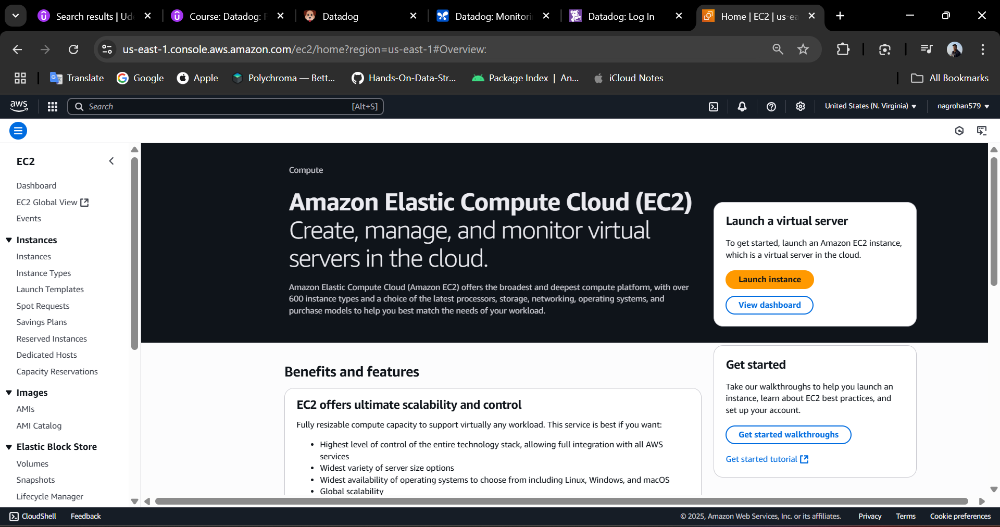

#### Launching EC2 Instance
We configure and launch a new EC2 instance with the following specifications:
- Instance type: t2.micro (free tier eligible)
- Operating System: Ubuntu Server
- Security group: Default (to be modified later)

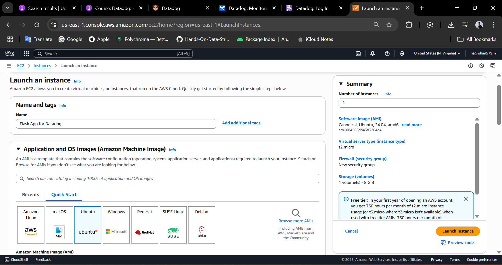

#### Instance Launch Success
After configuring all settings, the instance launches successfully.

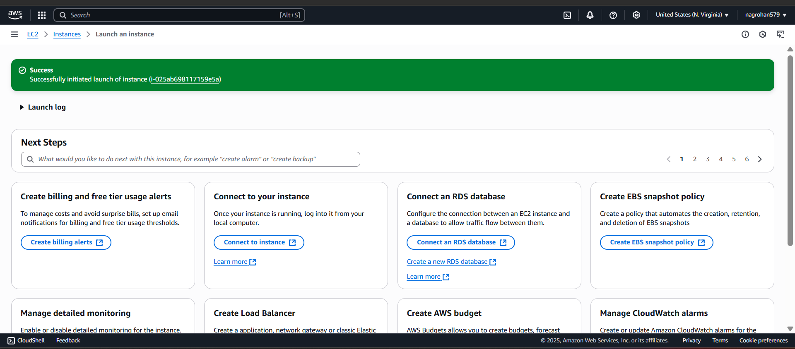

#### Verifying Running Instance
We can see our instance is now running in the EC2 instances dashboard.

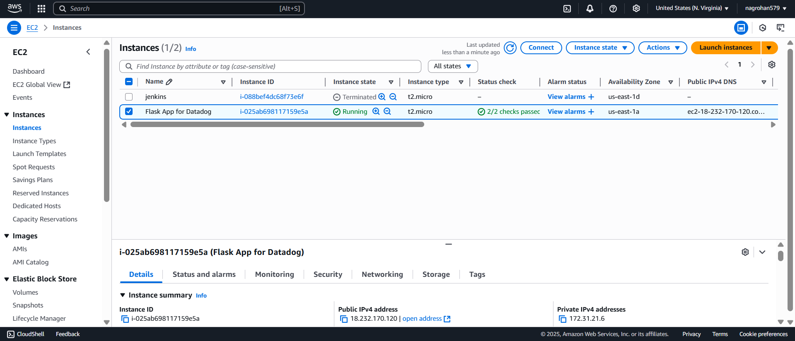

### 2. Security Group Configuration

#### Modifying Inbound Rules
To allow HTTP traffic to our Flask application, we need to modify the security group inbound rules to allow traffic on port 80.

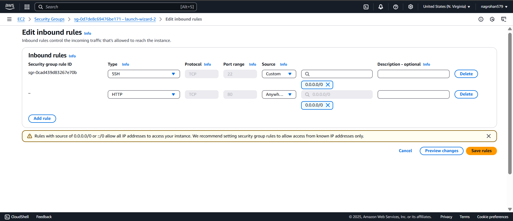

#### Updated Security Group Rules
The security group now allows HTTP traffic on port 80 from anywhere (0.0.0.0/0).

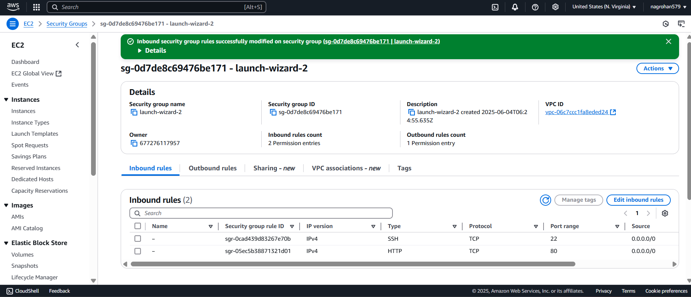

### 3. Connecting to EC2 Instance

#### SSH Connection
We connect to the EC2 instance using SSH with the provided PEM key file.

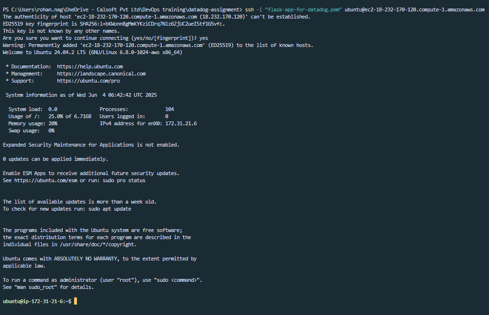

### 4. Flask Application Setup

#### Installing Dependencies
```bash
sudo apt update
sudo apt install -y python3 python3-flask
```

#### Creating the Flask Application
```bash
mkdir flask_app && cd flask_app
nano app.py
```

#### Flask Application Code
The `app.py` file contains a simple Flask application with two endpoints:

```python
from flask import Flask, request
import logging

app = Flask(__name__)

# Set up logging to a file
logging.basicConfig(filename='app.log', level=logging.INFO, format='%(asctime)s %(message)s')

@app.route('/')
def hello():
    logging.info('Home page accessed')
    return "Hello from Flask!"

@app.route('/ping')
def ping():
    logging.info('Ping endpoint hit from %s', request.remote_addr)
    return "Pong!"

if __name__ == '__main__':
    app.run(host='0.0.0.0', port=80)
```

**Application Features:**
- **Root endpoint (/)**: Returns a simple "Hello from Flask!" message
- **Ping endpoint (/ping)**: Returns "Pong!" and logs the client's IP address
- **Logging**: Each visit to both endpoints is logged with timestamps to `app.log` file
- **Network binding**: Runs on all interfaces (0.0.0.0) on port 80

#### Running the Application
```bash
sudo python3 app.py
```

#### Testing the Application
Access the application using the EC2 instance's public IP address:
- Home page: `http://<your-ec2-public-ip>/`
- Ping endpoint: `http://<your-ec2-public-ip>/ping`

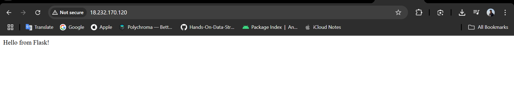

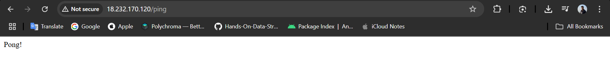

### 5. Datadog Setup and Integration

#### Accessing Datadog
We navigate to the Datadog website to set up monitoring.

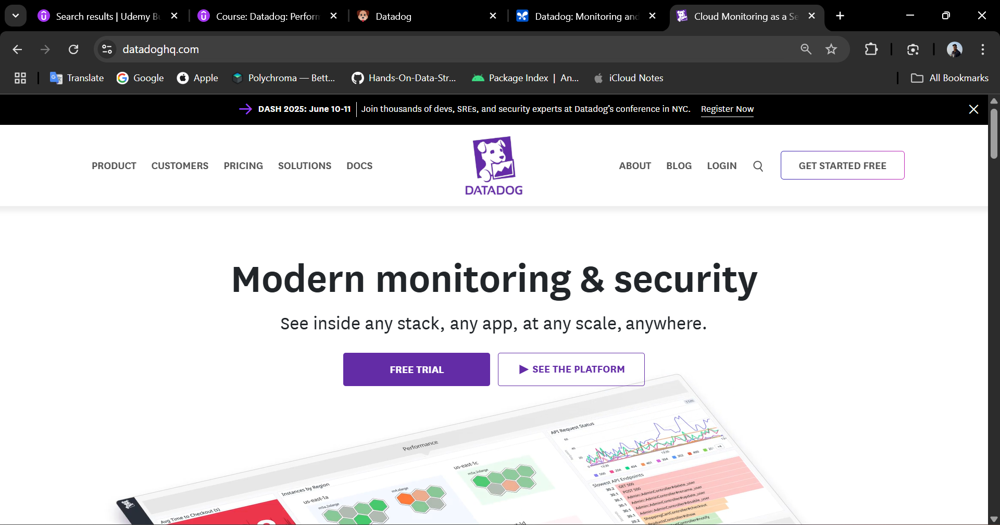

#### Creating Account and Quickstart
After creating a free trial account, the quickstart page provides setup instructions.

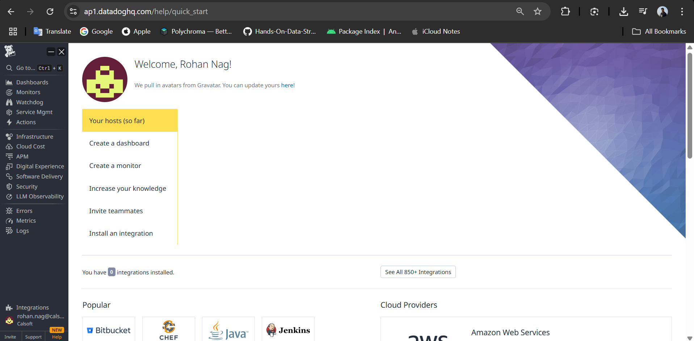

#### Agent Installation Instructions
Navigate to Integrations > Install Agent and select Linux in the Hosts section.

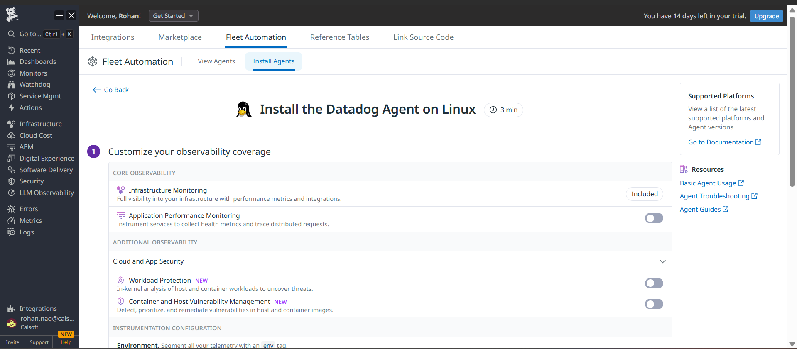

#### Installing Datadog Agent
Run the following command on the EC2 instance to install the Datadog agent:

```bash
DD_API_KEY=<API_KEY> \
DD_SITE="ap1.datadoghq.com" \
DD_APM_INSTRUMENTATION_ENABLED=host \
DD_APM_INSTRUMENTATION_LIBRARIES=java:1,python:3,js:5,php:1,dotnet:3 \
bash -c "$(curl -L https://install.datadoghq.com/scripts/install_script_agent7.sh)"
```

### 6. Log Collection Configuration

#### Enable Log Collection in Agent
Edit the main Datadog agent configuration:
```bash
sudo nano /etc/datadog-agent/datadog.yaml
```

Add the following line:
```yaml
logs_enabled: true
```

#### Configure Custom Log Source
Create a custom log configuration for the Flask application:
```bash
sudo nano /etc/datadog-agent/conf.d/flask_app.d/conf.yaml
```

Add the following configuration:
```yaml
logs:
  - type: file
    path: /home/ubuntu/flask_app/app.log
    service: flask-app
    source: python
    sourcecategory: sourcecode
```

#### Restart Datadog Agent
```bash
sudo systemctl restart datadog-agent
```

#### Verification
After configuration, the agent appears in the Datadog dashboard under the "View Agents" section.

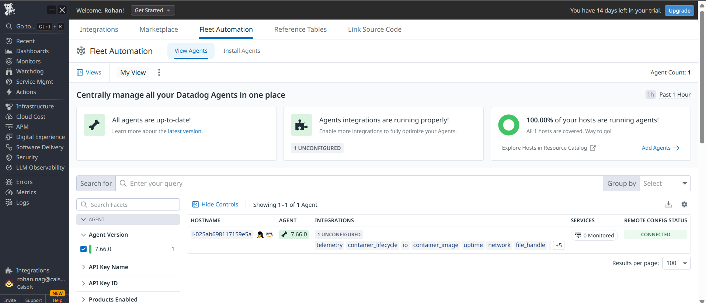

### Video demo

https://github.com/user-attachments/assets/88b8c053-e4a3-4f5c-9ccc-03f9e1bfc7b7


## Problems Faced and Resolution

### Issue: Log Collection Not Working

**Problem Description:**
Initially, logs from the Flask application were not appearing in the Datadog logs section. Upon investigation, the following error was found in the agent status:

```
Status: Error: cannot read file /home/ubuntu/flask_app/app.log: stat /home/ubuntu/flask_app/app.log: permission denied
```

**Root Cause:**
The Datadog agent didn't have the necessary permissions to read the log file. The agent runs under the `datadog-agent` user, which didn't have access to the user's home directory and the log file.

**Resolution:**
Fixed the permission issue by granting appropriate access to the Datadog agent:

```bash
# Grant execute permission on home directory for others
sudo chmod o+rx /home/ubuntu

# Grant execute permission on flask_app directory for others  
sudo chmod o+rx /home/ubuntu/flask_app

# Grant read permission on the log file for others
sudo chmod o+r /home/ubuntu/flask_app/app.log
```

**Command Explanations:**
- `chmod o+rx /home/ubuntu`: Grants read and execute permissions to "others" (including datadog-agent user) on the home directory
- `chmod o+rx /home/ubuntu/flask_app`: Grants read and execute permissions on the flask_app directory so the agent can navigate into it
- `chmod o+r /home/ubuntu/flask_app/app.log`: Grants read permission on the actual log file

After applying these permissions, restart the Datadog agent:
```bash
sudo systemctl restart datadog-agent
```

**Result:**
The permission fix resolved the issue, and logs from the Flask application started appearing in the Datadog logs dashboard successfully.

## Key Learnings

1. **AWS EC2 Security Groups**: Proper configuration of inbound rules is crucial for web application accessibility
2. **Datadog Agent Permissions**: The agent requires appropriate file system permissions to access log files
3. **Flask Logging**: Implementing structured logging helps with application monitoring and debugging
4. **Infrastructure Monitoring**: Datadog provides comprehensive observability for applications and infrastructure

## Files in This Assignment

- `app.py`: Simple Flask web application with logging capabilities
- `flask-app-for-datadog.pem`: SSH key file for EC2 instance access
- Various PNG files: Screenshots documenting the setup process
- `README.md`: This documentation file

## Conclusion

This assignment successfully demonstrates the integration of a Flask web application running on AWS EC2 with Datadog monitoring. The setup provides real-time log monitoring capabilities and showcases how to troubleshoot common permission issues in Linux environments when configuring monitoring agents.
