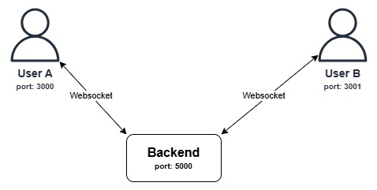

# Localhost Chat Application - Assignment: Use Docker to containerize an application and demo

A real-time chat application using Docker and WebSockets that simulates communication between two users on a localhost environment.

## Architecture

This application is fully containerized and orchestrated using Docker Compose. It consists of three main services:

- **FrontendA**: React.js app for User A (exposed on port 3000)
- **FrontendB**: React.js app for User B (exposed on port 3001)
- **Backend**: Python FastAPI WebSocket server (exposed on port 5000)

All services are defined in [`docker-compose.yml`](./docker-compose.yml) and communicate over a Docker network. The frontend containers connect to the backend using the Docker service name (`backend`) as the host, ensuring reliable service discovery within the Docker network.

### System Diagram



- Each frontend container is a separate instance of the same React app, configured via environment variables to represent User A or User B.
- The backend manages WebSocket connections for both users and routes messages accordingly.

## How It Works

- When you start the app with Docker Compose, three containers are created: two for the frontend (User A and User B) and one for the backend.
- The frontend connects to the backend WebSocket server using `window.location.hostname` (not hardcoded `backend`), e.g., `ws://localhost:5000/ws/A` or `ws://localhost:5001/ws/B` when accessed through the browser.
- Inside the Docker network, containers can still reference each other using service names, but the browser uses the hostname through which the application is accessed.
- Messages sent from one user are routed by the backend to the intended recipient in real time.

## Setup & Running Instructions

### Prerequisites
- Docker and Docker Compose installed on your machine

### Steps to Run

1. Clone this repository
2. Navigate to the [`docker-assignment`](.) directory
3. Run the following command:

```
docker compose up
```

This will build and start all services. No other setup is required.

### Access the Application
- User A: http://localhost:3000
- User B: http://localhost:3001
- Backend API: ws://localhost:5000

## Directory Structure

```
docker-assignment/
├── frontend/           # React application
│   ├── [Dockerfile](./frontend/Dockerfile)
│   └── src/            # React components and styling
├── backend/            # Python WebSocket server 
│   ├── [Dockerfile](./backend/Dockerfile)
│   └── [server.py](./backend/server.py)       # FastAPI WebSocket implementation
├── [docker-compose.yml](./docker-compose.yml)  # Container orchestration
└── [README.md](./README.md)           # Project documentation
```

## Issues Faced

- **WebSocket Connection Issue**: Initially, browser clients couldn't connect to the WebSocket server. The issue was that the React frontend was trying to connect to `ws://backend:5000/ws/A` or `ws://backend:5000/ws/B`, but "backend" is a Docker service name that's only resolvable within the Docker network, not from the browser. The fix was to modify the WebSocket connection code in App.js to use `window.location.hostname` instead of hardcoding the backend service name. This ensures that when the application is accessed through localhost:3000 or localhost:3001, the WebSocket connections properly use the same hostname that the application is being accessed through (e.g., `ws://localhost:5000/ws/A`), making the connections work in the browser environment while still maintaining the containerized architecture.

## How to Use

1. Open User A's interface in one browser window (http://localhost:3000)
2. Open User B's interface in another browser window (http://localhost:3001)
3. Start sending messages between the two users

## Future Improvements

- Add message persistence using Redis or a database
- Implement user authentication
- Add typing indicators
- Support for image and file sharing

## Running Demo

https://github.com/user-attachments/assets/d38c3358-f6ed-459d-9783-c63dcfffb3dd

