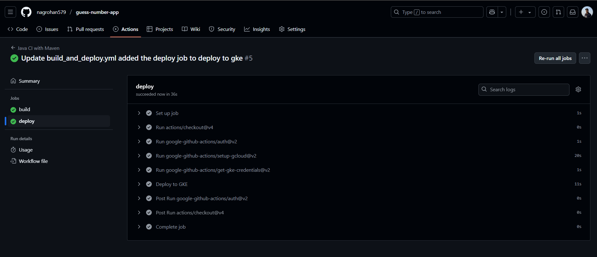

# GitHub Actions CI/CD Pipeline for My Java Maven Application

This README describes how I set up a complete CI/CD pipeline using **GitHub Actions** for my Java application built with Maven. I used the same application as in my previous Jenkins assignment.

- **Application Repository:** [guess-number-app](https://github.com/nagrohan579/guess-number-app.git)
- **GitHub Actions Workflow File:** [build_and_deploy.yml](https://github.com/nagrohan579/guess-number-app/blob/main/.github/workflows/build_and_deploy.yml)

---

## 1. Setting Up the Workflow

I went to my GitHub repo and opened the **Actions** page. There, I searched for the **Java with Maven** template because my app uses Java and Maven.


I clicked **Configure** to open the template in the online editor and renamed the file to `build_and_deploy.yml` since I planned to add deployment steps later.


### Workflow Template Explained
```yaml
name: Java CI with Maven

on:
  push:
    branches: [ "main" ]
  pull_request:
    branches: [ "main" ]

jobs:
  build:
    runs-on: ubuntu-latest
    steps:
      - uses: actions/checkout@v4
      - name: Set up JDK 17
        uses: actions/setup-java@v4
        with:
          java-version: '17'
          distribution: 'temurin'
          cache: maven
      - name: Build with Maven
        run: mvn -B package --file pom.xml
      # Optional: Uploads the full dependency graph to GitHub to improve the quality of Dependabot alerts this repository can receive
      - name: Update dependency graph
        uses: advanced-security/maven-dependency-submission-action@571e99aab1055c2e71a1e2309b9691de18d6b7d6
```
- **on**: Triggers the workflow on push or pull request to the `main` branch.
- **jobs.build**: Runs the build job on Ubuntu.
- **actions/checkout**: Checks out my code.
- **setup-java**: Sets up JDK 17.
- **Build with Maven**: Runs the Maven build.
- **Update dependency graph**: (Optional) Submits dependency graph for security analysis.

I committed the changes with a descriptive message.


After committing, the workflow ran automatically.


If the workflow failed at the dependency graph step:


I removed the dependency graph step since I didn't need it. After committing again, the workflow succeeded:


---

## 2. Building and Pushing Docker Image to DockerHub

To build and push a Docker image, I used the **Docker Build & Push Action** from the GitHub Actions Marketplace.


I added this step to my workflow YAML:
```yaml
    - name: Build and Push Docker Image
      uses: mr-smithers-excellent/docker-build-push@v6
      with:
        image: rohannagcalsoft/guess-number-app
        registry: docker.io
        username: ${{ secrets.DOCKER_USERNAME }}
        password: ${{ secrets.DOCKER_PASSWORD }}
```
- **image**: My DockerHub image name.
- **registry**: DockerHub registry.
- **username/password**: I used GitHub secrets for credentials.

I added my DockerHub credentials as secrets:
- Went to **Settings > Secrets and variables > Actions > New repository secret**
- Added `DOCKER_USERNAME` and `DOCKER_PASSWORD`


I committed the changes. The workflow built and pushed the image.


When I checked DockerHub, the image had a random tag (like `main-cef729d`):


To use the `latest` tag, I updated the workflow:
```yaml
    - name: Build and Push Docker Image
      uses: mr-smithers-excellent/docker-build-push@v6
      with:
        image: rohannagcalsoft/guess-number-app
        tags: latest
        registry: docker.io
        username: ${{ secrets.DOCKER_USERNAME }}
        password: ${{ secrets.DOCKER_PASSWORD }}
```
After committing and running the workflow again, the `latest` tag appeared in DockerHub:


---

## 3. Deploying to Google Kubernetes Engine (GKE)

I added my Google Service Account Key as a secret:
- Went to **Settings > Secrets and variables > Actions > New repository secret**
- Added `GCP_SA_KEY`


I added this deploy job to my workflow:
```yaml
deploy:
  needs: build
  runs-on: ubuntu-latest
  steps:
    - uses: actions/checkout@v4
    - uses: google-github-actions/auth@v2
      with:
        credentials_json: '${{ secrets.GCP_SA_KEY }}'
    - uses: google-github-actions/setup-gcloud@v2
      with:
        project_id: gke-guess-number-app
    - uses: google-github-actions/get-gke-credentials@v2
      with:
        cluster_name: gke-guess-number-game
        location: us-central1-c
    - name: Deploy to GKE
      run: kubectl apply -f k8s/
```
- **auth**: Authenticates to GCP using my service account key.
- **setup-gcloud**: Sets up Google Cloud SDK.
- **get-gke-credentials**: Gets credentials for my GKE cluster.
- **Deploy to GKE**: Applies Kubernetes manifests from the `k8s/` directory.

I committed the changes. Both build and deploy phases completed successfully:



---

## 4. Verifying the Deployment

I went to Google Cloud Console and checked if the pods and services were running:
```sh
kubectl get pods
kubectl get svc
```


I copied the **External IP** of the service and opened it in my browser:
```
http://<External IP>:8080
```

My app was live!


---

## Summary
- I set up CI/CD with GitHub Actions for my Java Maven app
- Built and pushed Docker images to DockerHub
- Deployed to GKE using GitHub Actions
- Verified deployment in the browser

This pipeline gives me a robust, automated workflow for building, testing, containerizing, and deploying my application using modern DevOps practices.
