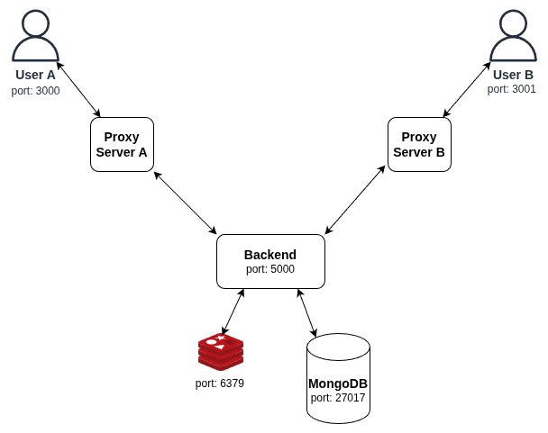

# Localhost Chat Application - Kubernetes Assignment

A real-time chat application deployed on Kubernetes with message persistence and scalability features.

## Architecture

This application has been migrated from Docker Compose to Kubernetes and enhanced with several new components. It now consists of:

- **FrontendA** and **FrontendB**: React.js apps for User A and B respectively
- **ProxyA** and **ProxyB**: Node.js proxy servers that handle port forwarding and routing
- **Backend**: Python FastAPI WebSocket server for real-time communication
- **Redis**: Used for pub/sub messaging between backend instances for scalability
- **MongoDB**: Provides persistent storage for chat message history

The application leverages Kubernetes features like Services for service discovery and PersistentVolumeClaims (PVCs) for data persistence.

### System Diagram



- Each frontend container is configured via environment variables to represent User A or User B.
- The proxy servers route traffic to the appropriate backend services.
- Redis pub/sub enables real-time communication between scaled backend instances.
- MongoDB stores chat history that persists beyond pod lifecycles.

## How It Works

- The application is deployed as a set of Kubernetes resources (Deployments, Services, PVCs).
- The frontend applications connect to their respective proxy services (not directly to the backend).
- The backend uses Redis pub/sub to enable message broadcasting across multiple instances.
- Messages are stored in MongoDB for persistence and retrieved when users connect.
- PersistentVolumeClaims ensure that MongoDB data survives pod restarts or cluster shutdowns.

## Setup & Running Instructions

### Prerequisites
- Kubernetes cluster (minikube, kind, or a cloud provider)
- kubectl configured to access your cluster
- Helm (optional, for Helm-based deployment)

### Deployment Options

The application includes a flexible deployment script (`deploy.sh`) that supports multiple deployment methods:

#### Build Images Only
```bash
./deploy.sh build
```

#### Deploy Using Kubernetes Manifests
```bash
./deploy.sh deploy
```

#### Deploy Using Helm Charts
```bash
./deploy.sh deploy helm
```

#### Build and Deploy in One Step
```bash
./deploy.sh all            # Build and deploy using Kubernetes manifests
./deploy.sh all helm       # Build and deploy using Helm chart
```

#### Auto-Opening in Browser
Add the `--auto-open` flag to automatically open the application in your browser:
```bash
./deploy.sh all --auto-open
./deploy.sh all helm --auto-open
```

#### Access the Running Application
```bash
./deploy.sh run
```

#### Clean Up Resources
```bash
./deploy.sh clean
```

### Access the Application
After deployment, the application will be accessible at:
- User A: http://localhost:3000
- User B: http://localhost:3001

## Directory Structure

```
kubernetes-assignment/
├── frontend/           # React application source code
│   └── Dockerfile      # Container image definition for frontend
├── backend/            # Python FastAPI WebSocket server
│   └── Dockerfile      # Container image definition for backend
├── proxy/              # Node.js proxy server
│   └── Dockerfile      # Container image definition for proxy
├── manifests/          # Kubernetes manifest files
│   ├── frontend-a-deployment.yaml
│   ├── frontend-b-deployment.yaml
│   ├── proxy-a-deployment.yaml
│   ├── proxy-b-deployment.yaml
│   ├── backend-deployment.yaml
│   ├── redis-deployment.yaml
│   └── mongo-deployment.yaml
├── helm-chart/         # Helm chart for the application
│   ├── Chart.yaml
│   ├── values.yaml
│   └── templates/      # Helm templates
├── deploy.sh           # Deployment helper script
├── proxy_3000.sh       # Port forwarding helper for User A
└── proxy_3001.sh       # Port forwarding helper for User B
```

## Issues Faced & Resolutions

### WebSocket Connection Issues in Kubernetes
When migrating from Docker Compose to Kubernetes, direct WebSocket connections to the backend (`ws://localhost:5000/ws/A` and `ws://localhost:5000/ws/B`) stopped working. This was because:

1. In Kubernetes, pods run on a virtual network and aren't directly accessible from the host machine
2. Service names and resolution work differently than in Docker Compose
3. Each service has its own IP address within the cluster

**Resolution:** Implemented dedicated proxy servers (Node.js) that:
- Act as intermediaries between the frontend and backend services
- Handle proper routing of WebSocket connections
- Pass through authentication and maintain connection state

This proxy architecture ensures proper WebSocket communication while maintaining the separation of concerns in the Kubernetes environment.

### Port Mapping and Access Issues
When deploying to Kubernetes, the frontend pods were accessible on random ports assigned by Kubernetes instead of the fixed ports 3000 and 3001 needed for user access. Additionally, multiple services needed to be exposed on the same ports.

**Resolution:** Created custom port-forwarding scripts (`proxy_3000.sh` and `proxy_3001.sh`) that:
1. Clear any existing processes using the target ports (3000/3001)
2. Set up port forwarding for the frontend services:
   ```bash
   kubectl port-forward svc/frontend-a-service 3000:3000
   kubectl port-forward svc/frontend-b-service 3001:3000
   ```
3. Set up separate port forwarding for the backend service:
   ```bash
   kubectl port-forward svc/backend 3000:5000  # For User A
   kubectl port-forward svc/backend 3001:5000  # For User B
   ```
4. Include proper cleanup functions when the scripts are terminated

These scripts ensure that both the frontend and backend services are accessible on the expected ports, with User A using port 3000 and User B using port 3001, maintaining the same user experience as the Docker Compose version.

## Key Technical Features

### Persistent Storage
MongoDB uses a PersistentVolumeClaim to ensure data persists even when pods are deleted or rescheduled. This provides:
- Durability of chat history
- Data survives pod restarts and cluster shutdowns
- Consistent user experience across sessions

### Redis Pub/Sub Architecture
Redis is used for a publish/subscribe messaging pattern that:
- Enables scaling the backend horizontally
- Allows messages to be broadcast to all connected backend instances
- Ensures users connected to different backend pods can communicate

### Helm Chart Deployment
The application includes a Helm chart that:
- Simplifies deployment with a single command
- Consolidates configuration into values.yaml
- Makes it easier to customize the deployment
- Provides templating for consistent resource definitions

## How to Use

1. Deploy the application using one of the methods described above
2. Access User A's interface through http://localhost:3000
3. Access User B's interface through http://localhost:3001
4. Start sending messages between the users
5. Messages are persisted in MongoDB and will be available even after restart

## Accessing MongoDB Data

To view the stored chat messages directly in the MongoDB database:

1. Get a list of all pods in your cluster to identify the MongoDB pod name:
   ```bash
   kubectl get pods
   ```

2. Connect to the MongoDB pod's shell:
   ```bash
   kubectl exec -it <mongodb-pod-name> -- mongo
   ```
   Replace `<mongodb-pod-name>` with the actual pod name from step 1 (e.g., `mongodb-7b7bf9d5fd-g2vxt`).

3. Once connected to the MongoDB shell, list the available databases:
   ```
   show dbs
   ```

4. Switch to the chat application database:
   ```
   use chat_app
   ```

5. View the stored messages:
   ```
   db.messages.find().pretty()
   ```

6. You'll see output similar to this:
   ```json
   {
           "_id" : ObjectId("68171d68a2d97f42daf162d9"),
           "from" : "B",
           "to" : "A",
           "text" : "hello",
           "timestamp" : "2025-05-04T07:55:20.806Z"
   }
   {
           "_id" : ObjectId("68171d6e38c92bb66f8d4734"),
           "from" : "A",
           "to" : "B",
           "text" : "how are you?",
           "timestamp" : "2025-05-04T07:55:26.559Z"
   }
   ```

This allows you to verify that messages are being properly stored in the database and persist beyond pod restarts.

## Future Improvements

- Implement user authentication
- Add typing indicators
- Support for image and file sharing
- Add Kubernetes Ingress for easier external access
- Implement horizontal pod autoscaling

