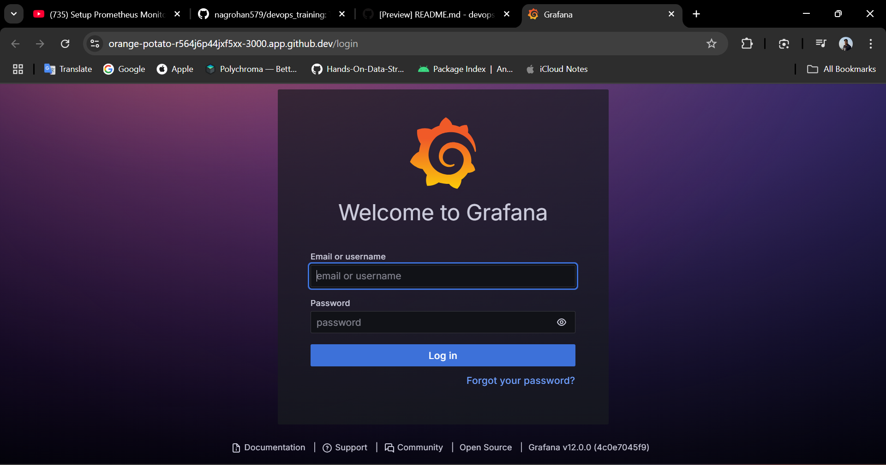
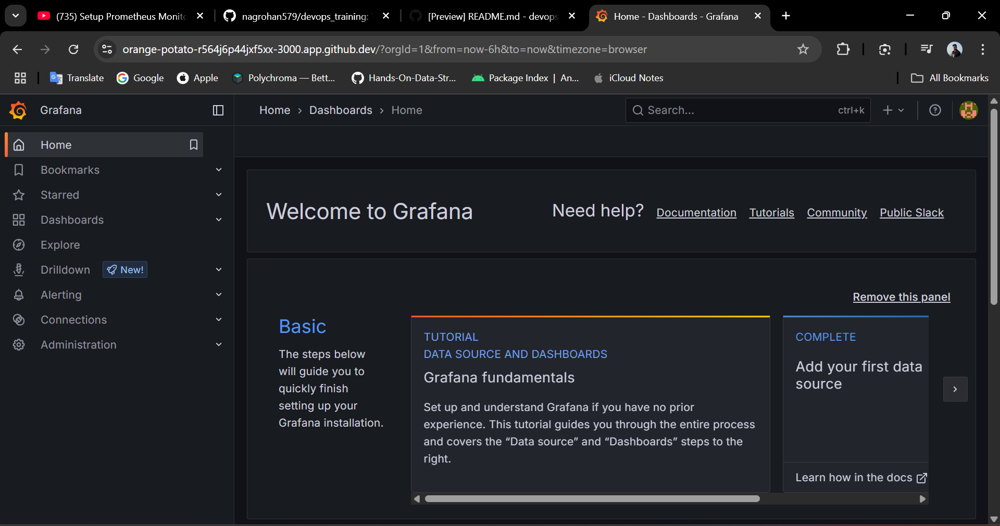

# Prometheus & Grafana Monitoring on Kubernetes (Minikube)

This assignment demonstrates how I set up Prometheus and Grafana to monitor a Kubernetes cluster using Minikube and Helm.

## Prerequisites
- Minikube installed and running
- kubectl configured for your cluster
- Helm installed

---

## 1. I started Minikube
I started my local Kubernetes cluster with:

```sh
minikube start
```

---

## 2. I added the Prometheus Helm repository
I added the Prometheus Community Helm charts and updated them:

```sh
helm repo add prometheus-community https://prometheus-community.github.io/helm-charts
helm repo update
```

---

## 3. I installed the Prometheus Operator Stack
I installed the kube-prometheus-stack using Helm:

```sh
helm install prometheus prometheus-community/kube-prometheus-stack
```

I saw output confirming the deployment. Then, I checked the status of the pods:

```sh
kubectl get pods
```

Example output:
```
NAME                                                     READY   STATUS    RESTARTS   AGE
alertmanager-prometheus-kube-prometheus-alertmanager-0   2/2     Running   0          74s
prometheus-grafana-77bcfb9bdb-c9s44                      3/3     Running   0          96s
prometheus-kube-prometheus-operator-7cc65967d6-smvcs     1/1     Running   0          96s
prometheus-kube-state-metrics-7457555cf7-k72wb           1/1     Running   0          96s
prometheus-prometheus-kube-prometheus-prometheus-0       1/2     Running   0          72s
prometheus-prometheus-node-exporter-7bh6j                1/1     Running   0          96s
```

---

## 4. I accessed Grafana
Since the Grafana service is `ClusterIP` (internal), I needed to port-forward to access the UI.

First, I got the Grafana admin password:

```sh
kubectl get secrets prometheus-grafana -o jsonpath="{.data.admin-password}" | base64 -d ; echo
```

The default username is `admin` and the password is usually `prometheus-operator` (I verified with the command above).

I forwarded the Grafana port to my local machine:

```sh
kubectl port-forward deployment/prometheus-grafana 3000
```

Then, I opened my browser and went to [http://localhost:3000](http://localhost:3000).

- **Grafana Login Page:**
  

I logged in with:
- **Username:** `admin`
- **Password:** `prometheus-operator`

- **Grafana Home Page:**
  

---

## 5. Useful Commands I Used
- To list all services:
  ```sh
  kubectl get svc
  ```
- To list all deployments:
  ```sh
  kubectl get deployment
  ```
- To check logs for Grafana:
  ```sh
  kubectl logs <grafana-pod-name> -c grafana
  ```

---

## References
- [kube-prometheus-stack Helm Chart](https://github.com/prometheus-community/helm-charts/tree/main/charts/kube-prometheus-stack)
- [Prometheus Operator Documentation](https://github.com/prometheus-operator/kube-prometheus)

---

This setup shows how I successfully deployed a robust monitoring solution for my Kubernetes cluster using Prometheus and Grafana. I can now explore cluster metrics and dashboards with ease!
