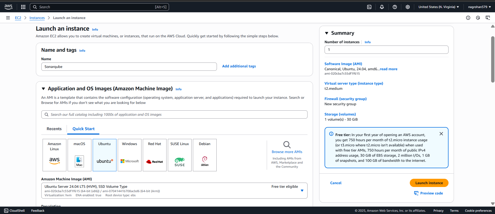
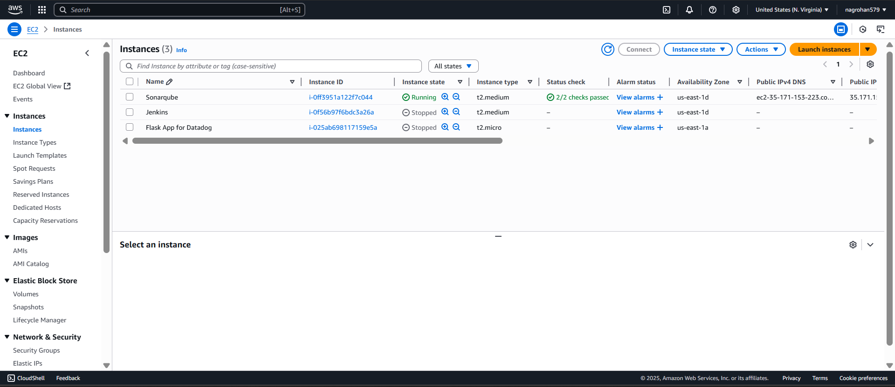
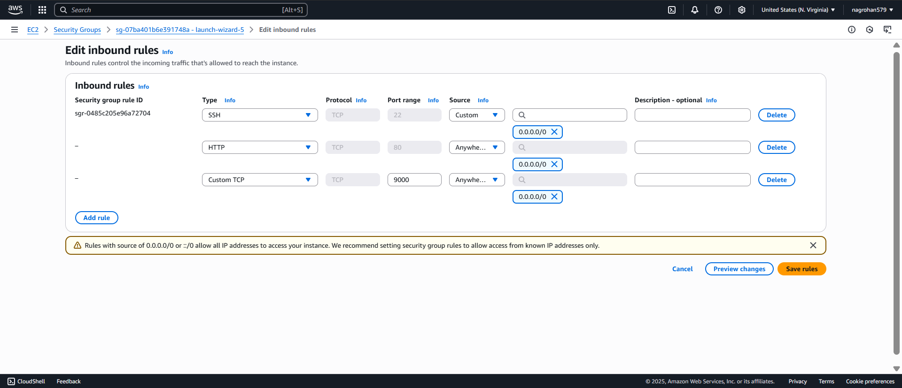
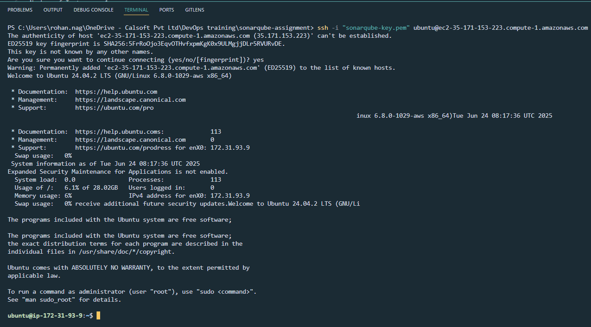
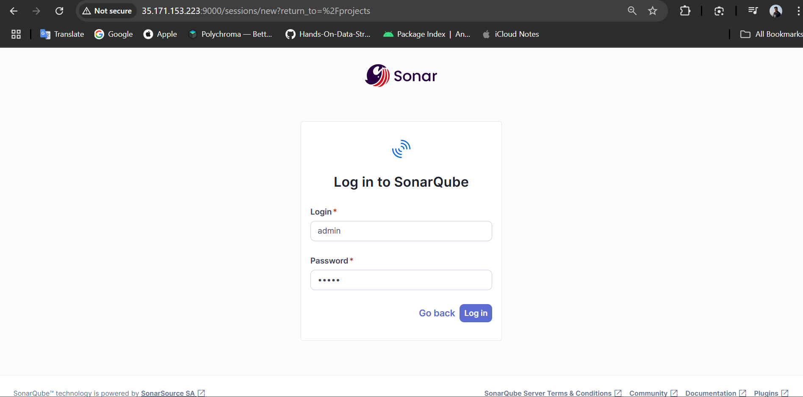
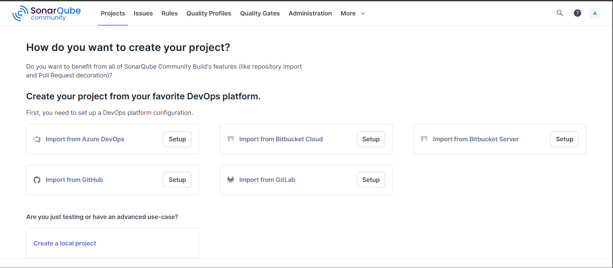
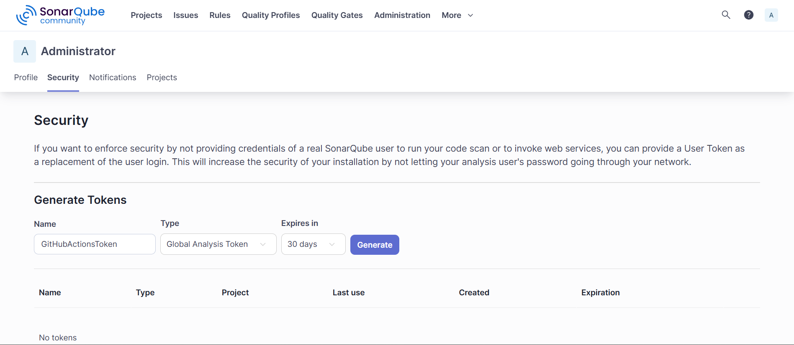
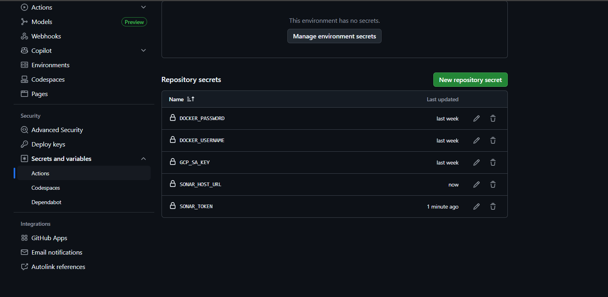
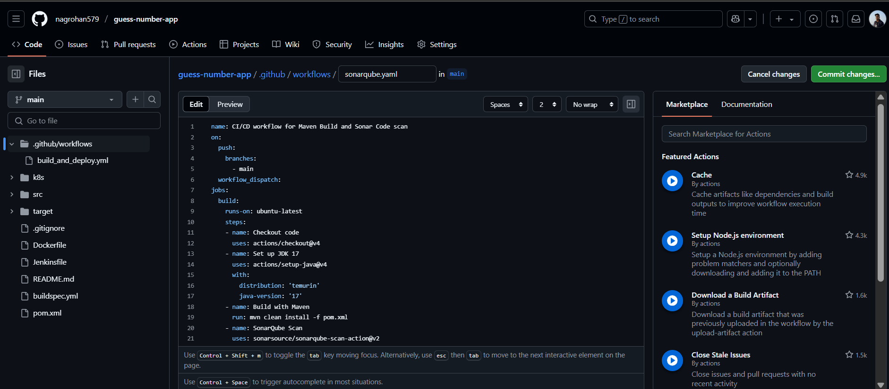
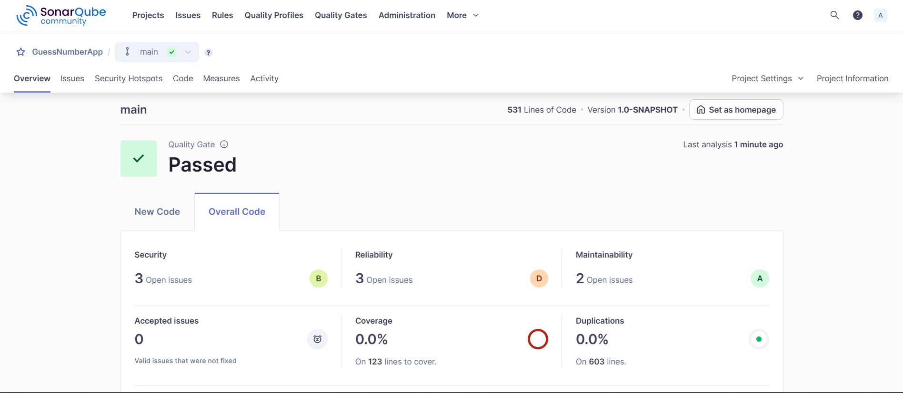

# SonarQube Assignment

## Overview

In this SonarQube assignment, I'll be installing SonarQube on an EC2 instance and using the application from my previous Jenkins, GitHub Actions, and AWS CodePipeline assignments to analyze code quality. I'll integrate GitHub Actions to trigger SonarQube analysis automatically after each push to the repository.

## Prerequisites

- AWS Account with EC2 access
- GitHub repository with a Java/Maven application
- Basic knowledge of Docker and Docker Compose

## Step 1: Creating EC2 Instance

First, I navigate to the AWS console to create an EC2 instance with the following specifications:

- **Name**: Sonarqube
- **Number of Instances**: 1
- **Application and OS Image (AMI)**: Ubuntu Server 24.04 LTS
- **Instance Type**: t2.medium
- **Firewall (Security Group)**: A new security group will be created
- **Storage (Volumes)**: One volume with 30 GiB of storage



The instance is now running successfully:



## Step 2: Configuring Security Group

Next, I needed to add inbound rules to the security group to allow traffic on the necessary ports for SonarQube:

- **SSH (port 22)** — for my IP address
- **HTTP (port 80)** — for browser access
- **Port 9000** — SonarQube default port



## Step 3: Connecting to EC2 Instance

I connected to the instance via SSH:



## Step 4: System Configuration

### Configure System Parameters

I edited the system limits file:

```bash
sudo nano /etc/sysctl.conf
```

I added the following lines to the bottom of the file:

```
vm.max_map_count=262144
fs.file-max=65536
```

I saved the file with `Ctrl + O` and `Enter`, then exited with `Ctrl + X`.

I applied the changes:

```bash
sudo sysctl -p
```

### Change Hostname

I changed the hostname:

```bash
sudo hostnamectl set-hostname SonarQube
```

### System Update

I performed a system update:

```bash
sudo apt update
```

### Install Docker Compose

I installed Docker Compose:

```bash
sudo apt install docker-compose -y
```

## Step 5: SonarQube Installation

### Create Docker Compose Configuration

I created a `docker-compose.yml` file:

```bash
sudo nano docker-compose.yml
```

I added the following configuration:

```yaml
version: "3"
services:
  sonarqube:
    image: sonarqube:community
    restart: unless-stopped
    depends_on:
      - db
    environment:
      SONAR_JDBC_URL: jdbc:postgresql://db:5432/sonar
      SONAR_JDBC_USERNAME: sonar
      SONAR_JDBC_PASSWORD: sonar
    volumes:
      - sonarqube_data:/opt/sonarqube/data
      - sonarqube_extensions:/opt/sonarqube/extensions
      - sonarqube_logs:/opt/sonarqube/logs
    ports:
      - "9000:9000"
  db:
    image: postgres:12
    restart: unless-stopped
    environment:
      POSTGRES_USER: sonar
      POSTGRES_PASSWORD: sonar
    volumes:
      - postgresql:/var/lib/postgresql
      - postgresql_data:/var/lib/postgresql/data

volumes:
  sonarqube_data:
  sonarqube_extensions:
  sonarqube_logs:
  postgresql:
  postgresql_data:
```

I saved and exited the file with `:wq!`.

### Start SonarQube Services

I executed the Docker Compose file:

```bash
sudo docker-compose up -d
```

I checked the status of the containers:

```bash
sudo docker ps
```

## Step 6: SonarQube Web Access

I accessed SonarQube in my browser using:

```
http://<your-ec2-public-ip>:9000
```



### Initial Login

I used the default credentials:
- **Default Username**: admin
- **Default Password**: admin

The system prompted me to change the password:
- **New Password**: RohanNag123#



## Step 7: GitHub Actions Integration

### Generate SonarQube Token

I generated a token for GitHub Actions integration:
1. I navigated to **Account** → **Security**
2. I created a new token with the following details:
   - **Name**: GitHubActionsToken
   - **Type**: Global Analysis Token
   - **Expires in**: 30 days
3. I clicked **Generate**



### Configure GitHub Secrets

I went to my GitHub repository, then **Settings** → **Secrets and variables** → **Actions** → **New repository secret**.

I created the following secrets:

1. **SONAR_TOKEN**
   - Value: `<the token I generated in SonarQube>`

2. **SONAR_HOST_URL**
   - Value: `http://<my-ec2-public-ip>:9000`



## Step 8: GitHub Actions Workflow

### Create SonarQube Workflow File

I created a new file `.github/workflows/sonarqube.yaml`:



### Final Workflow Configuration

After I created a project in SonarQube named "GuessNumberApp", I updated the workflow file with the following content:

```yaml
name: CI/CD workflow for Maven Build and Sonar Code scan

on:
  push:
    branches:
      - main
      
jobs:
  build:
    name: Build and analyze
    runs-on: ubuntu-latest
    
    steps:
      - uses: actions/checkout@v4
        with:
          fetch-depth: 0  # Shallow clones should be disabled for a better relevancy of analysis
      - name: Set up JDK 17
        uses: actions/setup-java@v4
        with:
          java-version: 17
          distribution: 'zulu' # Alternative distribution options are available.
      - name: Cache SonarQube packages
        uses: actions/cache@v4
        with:
          path: ~/.sonar/cache
          key: ${{ runner.os }}-sonar
          restore-keys: ${{ runner.os }}-sonar
      - name: Cache Maven packages
        uses: actions/cache@v4
        with:
          path: ~/.m2
          key: ${{ runner.os }}-m2-${{ hashFiles('**/pom.xml') }}
          restore-keys: ${{ runner.os }}-m2
      - name: Build and analyze
        env:
          SONAR_TOKEN: ${{ secrets.SONAR_TOKEN }}
          SONAR_HOST_URL: ${{ secrets.SONAR_HOST_URL }}
        run: mvn -B verify org.sonarsource.scanner.maven:sonar-maven-plugin:sonar -Dsonar.projectKey=GuessNumberApp -Dsonar.projectName='GuessNumberApp'
```

## Step 9: Results

After I successfully connected GitHub Actions with SonarQube, my code analysis results are now available:



## Demo video

https://github.com/user-attachments/assets/48cbd10e-c4ba-45f4-9f31-6ea015307fde


## Conclusion

This assignment successfully demonstrates what I accomplished:

- I set up SonarQube on AWS EC2 using Docker Compose
- I configured security groups and system parameters
- I integrated SonarQube with GitHub Actions for automated code quality analysis
- I created and managed SonarQube projects and tokens
- I implemented a CI/CD pipeline with code quality gates

The integration I created ensures that every push to the main branch triggers an automated code quality analysis, helping me maintain high code standards throughout my development lifecycle.
