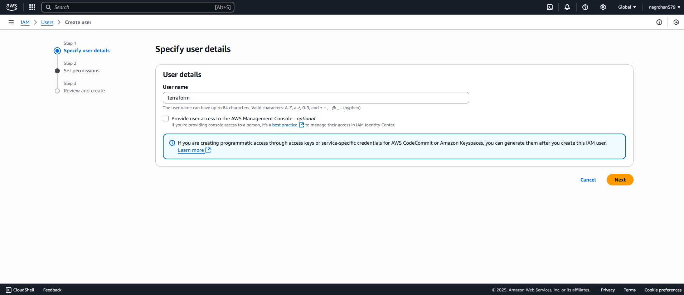

# Terraform Assignment

This is my comprehensive Terraform assignment where I demonstrate Infrastructure as Code (IaC) by provisioning AWS resources using Terraform. In this project, I set up a complete cloud infrastructure including VPC, subnets, ECS cluster, EKS cluster, RDS database, and S3 bucket.

## Project Overview

I created this assignment to showcase my understanding of Terraform and AWS resource management. The infrastructure includes:
- Custom VPC with public and private subnets
- ECS and EKS clusters for container orchestration
- RDS MySQL database instance
- S3 bucket for storage
- Proper networking with Internet Gateway and Route Tables

## Getting Started

### Step 1: Setting up the EC2 Instance

First, I started by spinning up an EC2 instance and installing Terraform on it.

**Configurations:**
- **Name**: I named the instance "Terraform"
- **Number of Instances**: 1
- **Software Image (AMI)**: Ubuntu Server 24.04 LTS (HVM), specifically the ami-020cba7c55df1f615 (Free Tier eligible)
- **Instance Type**: t2.micro (Virtual server type, part of AWS Free Tier)
- **Firewall (Security Group)**: I created a new security group
- **Storage (Volumes)**: 1 volume of 8 GiB


The instance was created successfully and is running.


I then connected to the instance via SSH.


### Step 2: Installing Terraform

I installed Terraform on the EC2 instance using the following commands:

```bash
sudo apt update && sudo apt install -y gnupg software-properties-common curl

curl -fsSL https://apt.releases.hashicorp.com/gpg | sudo gpg --dearmor -o /usr/share/keyrings/hashicorp-archive-keyring.gpg

echo "deb [signed-by=/usr/share/keyrings/hashicorp-archive-keyring.gpg] https://apt.releases.hashicorp.com $(lsb_release -cs) main" | \
  sudo tee /etc/apt/sources.list.d/hashicorp.list

sudo apt update
sudo apt install terraform

terraform -v
```

### Step 3: Setting up IAM User and AWS CLI

Next, I needed to create an IAM user account to allow Terraform to manage AWS resources.



For attaching policies, I chose "Attach policies directly" and selected the AdministratorAccess policy, which grants full access to all AWS services and resources.


The IAM User was created successfully. Then I created an access key for the IAM user, choosing the CLI access type.


The access key was created successfully.


I copied the Access Key and Secret Access Key to a safe location and downloaded the .csv file.

### Step 4: Installing and Configuring AWS CLI

I installed the AWS CLI on the EC2 instance:

```bash
sudo apt update
sudo apt install -y unzip curl

curl "https://awscli.amazonaws.com/awscli-exe-linux-x86_64.zip" -o "awscliv2.zip"
unzip awscliv2.zip
sudo ./aws/install

# Check version
aws --version
```

Then I configured AWS CLI with the Access Key Credentials:

```bash
aws configure
```

When prompted, I entered:
```plaintext
AWS Access Key ID [****************KJ7I]: <Access Key ID>
AWS Secret Access Key [****************0voi]: <Secret Access Key>
Default region name [None]: us-east-1
Default output format [None]: json
```

I verified the configuration:

```bash
aws sts get-caller-identity
``` 

Output:
```plaintext
{
    "UserId": "AIDAZ3MGNNPCX3GS7LT26",
    "Account": "677276117957",
    "Arn": "arn:aws:iam::677276117957:user/terraform"
}
```

## Terraform Configuration Files

### Step 5: Creating Terraform Configuration

I created a directory for my Terraform configuration files:

```bash
mkdir ~/terraform-aws
cd ~/terraform-aws
```

#### Provider Configuration

First, I created the [`provider.tf`](provider.tf) file to configure the AWS provider:

```bash
nano provider.tf
```

The [`provider.tf`](provider.tf) file contains the AWS provider configuration that tells Terraform which cloud provider to use and in which region to deploy resources.

#### Variables Configuration

Next, I created the [`variables.tf`](variables.tf) file to define my variables:

```bash
nano variables.tf
```

The [`variables.tf`](variables.tf) file defines all the configurable parameters for my infrastructure, including VPC CIDR blocks, subnet configurations, and database passwords. This makes my configuration reusable and flexible.

#### Main Infrastructure Configuration

Then I created the [`main.tf`](main.tf) file - the core of my infrastructure:

```bash
nano main.tf
```

The [`main.tf`](main.tf) file contains all the main infrastructure resources:
- **VPC**: Creates a custom Virtual Private Cloud with the specified CIDR block
- **Subnets**: Creates both public and private subnets in different availability zones
- **Internet Gateway**: Provides internet access to the public subnet
- **Route Tables**: Manages routing for network traffic
- **S3 Bucket**: Creates a storage bucket with a random suffix for uniqueness
- **RDS Instance**: Sets up a MySQL database in the private subnet
- **Security Groups**: Configures firewall rules for the database
- **ECS Cluster**: Creates a container orchestration cluster
- **EKS Cluster**: Sets up a Kubernetes cluster with necessary IAM roles

#### Outputs Configuration

Finally, I created the [`outputs.tf`](outputs.tf) file to define the outputs:

```bash
nano outputs.tf
```

The [`outputs.tf`](outputs.tf) file defines what information Terraform should display after successful deployment, including resource IDs, endpoints, and names that I might need for further configuration or reference.

### Step 6: Terraform Deployment

I initialized Terraform to download the required providers:

```bash
terraform init
```

Output:
```plaintext
Initializing the backend...
Initializing provider plugins...
- Finding latest version of hashicorp/random...
- Finding latest version of hashicorp/aws...
- Installing hashicorp/random v3.7.2...
- Installed hashicorp/random v3.7.2 (signed by HashiCorp)
- Installing hashicorp/aws v6.0.0...
- Installed hashicorp/aws v6.0.0 (signed by HashiCorp)
Terraform has created a lock file .terraform.lock.hcl to record the provider
selections it made above. Include this file in your version control repository
so that Terraform can guarantee to make the same selections by default when
you run "terraform init" in the future.

Terraform has been successfully initialized!

You may now begin working with Terraform. Try running "terraform plan" to see
any changes that are required for your infrastructure. All Terraform commands
should now work.

If you ever set or change modules or backend configuration for Terraform,
rerun this command to reinitialize your working directory. If you forget, other
commands will detect it and remind you to do so if necessary.
```

Next, I ran `terraform plan` to see the execution plan and verify what resources would be created:

```bash
terraform plan
```

The plan showed that Terraform would create 15 resources including VPC, subnets, security groups, RDS instance, S3 bucket, ECS cluster, EKS cluster, and associated networking components.

Finally, I applied the configuration to create all the resources:

```bash
terraform apply
```

## Verification of Created Resources

I verified that all resources were created successfully in the AWS console:

### VPC Created
I confirmed that my custom VPC was created with the correct CIDR block.


### Subnets Created
Both public and private subnets were created in their respective availability zones.


### Route Table Created
The route table was properly configured to route traffic through the Internet Gateway.


### Internet Gateway Created
The Internet Gateway was attached to my VPC to provide internet connectivity.


### ECS Cluster Created
My ECS cluster "rohan-ecs-cluster" was successfully created for container orchestration.


### EKS Cluster Created
The EKS cluster "rohan-eks-cluster" was created with the necessary IAM roles and permissions.


### RDS Database Created
My MySQL RDS instance was created in the private subnet with proper security group configuration.


### S3 Bucket Created
The S3 bucket was created with a unique name using the random ID generator.


## Key Learnings

Through this assignment, I learned:

1. **Infrastructure as Code**: How to define and manage cloud infrastructure using declarative configuration files
2. **Terraform Workflow**: The importance of `terraform init`, `terraform plan`, and `terraform apply` commands
3. **AWS Resource Management**: How different AWS services interact and depend on each other
4. **Security Best Practices**: Implementing proper security groups and IAM roles
5. **Resource Organization**: Structuring Terraform code across multiple files for maintainability

## File Structure

- [`provider.tf`](provider.tf) - AWS provider configuration
- [`variables.tf`](variables.tf) - Variable definitions for reusable configuration
- [`main.tf`](main.tf) - Main infrastructure resources definition
- [`outputs.tf`](outputs.tf) - Output values for created resources
- `images/` - Screenshots documenting the deployment process

This assignment demonstrates my ability to use Terraform for provisioning and managing AWS infrastructure effectively, following best practices for Infrastructure as Code.